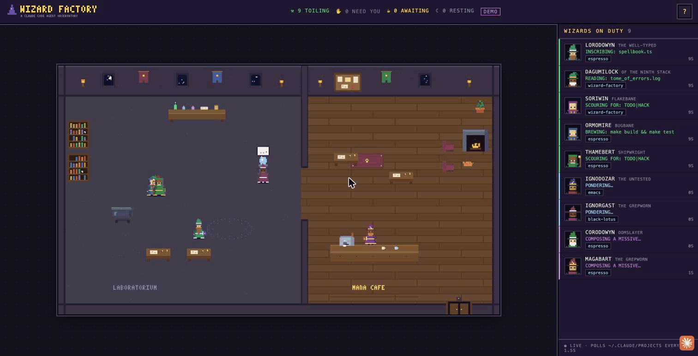

# 🧙 Wizard Factory

A retro 8-bit dashboard that shows every running coding agent as a pixel wizard
in a shared tower. Main sessions are wizards; subagents are apprentices. They move between
stations based on what they're doing, and wait for you at the café with a fresh drink when
their turn is done.



## Run

```sh
python3 server.py                  # → http://127.0.0.1:7777
python3 server.py --install-hooks  # one-time: instant "needs permission" alerts (see Hooks)
python3 server.py --demo           # fake wizards, for kicking the tires
python3 server.py --port N         # different port
```

No dependencies (Python 3 stdlib only).

## How it works

The server tails the transcript files written to
`~/.claude/projects/<project>/<session>.jsonl` (and
`<session>/subagents/agent-*.jsonl` for subagents), keeping byte offsets per file
and re-reading the tail if a file is rewritten. OpenAI Codex CLI sessions are
tracked the same way from `~/.codex/sessions/**/rollout-*.jsonl` — they appear as
hooded wizards with a `codex` chip, and one-shot `codex exec` runs (including
codex review subagents) finish and leave instead of waiting for input. From the
last few events it infers a status for each agent:

| status     | meaning                                   | where the wizard goes        |
|------------|-------------------------------------------|------------------------------|
| working    | a tool call is in flight                  | station for that tool        |
| thinking   | tool result landed / prompt being chewed  | stays put, `…` bubble        |
| responding | writing the final answer                  | stays put, quill bubble      |
| waiting    | turn ended, your move                     | café, fresh drink in hand    |
| attention  | needs permission (hooks mode only)        | petition board, red `!`      |
| idle       | waiting 15+ min                           | hearth armchairs, `Z`        |
| done       | subagent finished                         | celebrates, exits the door   |

Tool → station: Bash = cauldron · Read/Grep/Glob = bookshelves · Edit/Write =
writing desks · Web/MCP = crystal ball · Task/Agent/Skill = summoning circle ·
plans/questions = petition board.

Appearance and name are deterministic per agent id (seeded hats, beards, robes,
spectacles, staffs, and cafe order), so the same session keeps the same wizard
across reloads. Earl Grey, the dragon barista, brews cafe orders with fire and
pours milk for milk drinks. Biggles occasionally visits for a drink.
The frontend polls `/api/state` every 1.5s.

## Hooks: instant "needs your blessing"

Polling can't always distinguish a long-running Bash spell from a permission
prompt. Installing the hooks fixes that: the wizard runs to the petition board
with a red `!` the moment a session asks for approval, and arrivals/departures/turn
ends land instantly instead of on the next poll.

```sh
python3 server.py --install-hooks    # merges into ~/.claude/settings.json
python3 server.py --uninstall-hooks  # removes exactly what install added
```

This registers `Notification`, `Stop`, `UserPromptSubmit`, `SessionStart`, and
`SessionEnd` hooks. Safety properties: existing hooks and settings are left
untouched (verified round-trip), the write is atomic, a backup is kept at
`~/.claude/settings.json.wizard-bak`, install is idempotent, and each hook is a
fire-and-forget `curl` to `127.0.0.1:7777/hook` that exits 0 in under a second
even when the server isn't running. Hooks are captured at session startup, so
they only take effect for sessions started after installing —
already-running sessions keep working via polling alone.

## Notes

- Binds to 127.0.0.1 only.
- Sessions whose transcript hasn't been touched for 3h are ignored; waiting
  wizards leave after 45 min, finished apprentices after ~2 min.
- Desktop-app (bridge) sessions flush transcript content lazily, so "last sign"
  uses file mtime and statuses may lag a little for those.
- `python3 server.py --debug-scan` prints the inferred agent list as JSON.
- The cat is named Biggles. He is not configurable.
  [Editor's note: I didn't ask for a cat, this is 100% agent folklore.]
