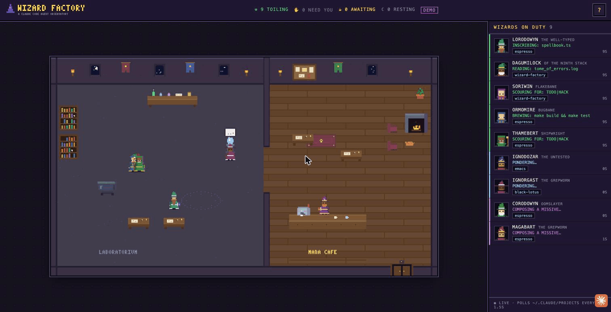

# 🧙 Wizard Factory

A retro 8-bit dashboard that shows every running coding agent in a shared tower.
Local sessions are pixel wizards, agents running remotely on `mage-tower` are demons,
and subagents are apprentices. They move between stations based on what they're doing,
and wait for you at the café with a fresh drink when their turn is done.



## Run

```sh
python3 server.py                  # → http://127.0.0.1:7777
python3 server.py --install-hooks  # one-time: instant "needs permission" alerts (see Hooks)
python3 server.py --demo           # fake wizards, for kicking the tires
python3 server.py --port N         # different port
```

No Python dependencies (remote polling also requires the system `ssh` command).

## How it works

The server tails local transcript files written to
`~/.claude/projects/<project>/<session>.jsonl` (and
`<session>/subagents/agent-*.jsonl` for subagents), keeping byte offsets per file
and re-reading the tail if a file is rewritten. It also polls the same paths on
`mage-tower` over SSH; remote agents are namespaced and displayed as demons. OpenAI Codex
CLI sessions are tracked the same way from `~/.codex/sessions/**/rollout-*.jsonl` —
they appear as hooded agents with a `codex` chip, and one-shot `codex exec` runs (including
codex review subagents) finish and leave instead of waiting for input. From the
last few events it infers a status for each agent:

| status     | meaning                                   | where the wizard goes        |
|------------|-------------------------------------------|------------------------------|
| working    | a tool call is in flight                  | laboratory station for that tool |
| thinking   | tool result landed / prompt being chewed  | stays put, `…` bubble        |
| responding | writing the final answer                  | stays put, quill bubble      |
| waiting    | turn ended, your move                     | café, fresh drink in hand    |
| attention  | needs permission (hooks mode only)        | petition board, red `!`      |
| idle       | waiting 15+ min                           | hearth armchairs, `Z`        |
| done       | subagent finished                         | celebrates, exits the door   |

Long-running command/test runs and explicit questions wait in the café even while
their transcript status is still `working`. Tool → station: Bash = cauldron ·
Read/Grep/Glob = bookshelves · Edit/Write/Plan/Todo = writing desks · Web/MCP =
crystal ball · Task/Agent/Skill = summoning circle · approvals = petition board.

Appearance and name are deterministic per agent id (seeded hats, beards, robes,
spectacles, staffs, and cafe order), so the same session keeps the same wizard
across reloads. Long quiet stretches are occasionally interrupted by a brief
tower-wide ray battle; victims magically reconstitute from their pixel fragments
and return to work, followed by a three-to-five-minute cooldown. Agents
of the opposite rank help their faction in a duel, with only one apprentice
joining the fray at a time; stronger defending support
reflects the blast at the aggressor, while a tie still hits the target. Agents
rarely challenge Earl Grey; those who do may bring one supporter, but he roasts each
assailant into soot in succession. Biggles and Lucipurr bypass duels and can
blast anyone, including Earl Grey, but are themselves immune. Earl Grey, the
dragon barista, brews cafe orders with fire and pours milk for milk drinks.
The frontend polls `/api/state` every 1.5s.

The laboratory's upper-right quota vats show remaining Claude and Codex capacity:
large vats are weekly windows, the thin vat is Claude's five-hour window, and each
provider has its own potion color. Claude's Fable quota coils through a spiral vat
the size of a weekly one. Liquid height shows quota remaining; hovering
reveals the exact percentage and full quota name. The countdown shows the next
reset, with matching floating blobs for any reset credits reported by the provider.

## The journal: what was said, and getting back to it

Clicking a wizard opens its journal. **Counsel & missives** is the exchange itself — your prompts
and the agent's replies, oldest first, scrolling like the window you were last looking at — read out
of the same transcripts as everything else (so it also arrives over SSH for demons). **⧉ open**
jumps you to that agent's terminal: it raises the Ghostty tab the agent already sits in, or opens a
window that reattaches to its tmux session, or creates one that resumes the transcript if the
session is gone — over `ssh -t` for demons.

That button and the link on every end-of-turn push notification both hit
`GET /open?id=<session>&token=<token>`, which runs `~/.agents/scripts/open-agent` using only the
fields the notify hooks recorded in `~/.agents/state/agents.json`. The token lives in
`~/.agents/state/open-token` (mode 0600, created on demand); requests without it are refused, so no
page you happen to be browsing can raise your terminals. Agents launched outside `code`/`hypercode`
have no tmux session recorded, so opening them resumes the transcript in a new session instead of
finding the original tab.

## Hooks: instant "needs your blessing"

Polling can't always distinguish a long-running Bash spell from a permission
prompt. Installing the hooks fixes that: the wizard runs to the petition board
with a red `!` the moment a session asks for approval, and arrivals/departures/turn
ends land instantly instead of on the next poll.

```sh
python3 server.py --install-hooks    # merges into ~/.claude/settings.json
python3 server.py --uninstall-hooks  # removes exactly what install added
```

This registers `Notification`, `Stop`, `UserPromptSubmit`, `SessionStart`, and
`SessionEnd` hooks. Safety properties: existing hooks and settings are left
untouched (verified round-trip), the write is atomic, a backup is kept at
`~/.claude/settings.json.wizard-bak`, install is idempotent, and each hook is a
fire-and-forget `curl` to `127.0.0.1:7777/hook` that exits 0 in under a second
even when the server isn't running. Hooks are captured at session startup, so
they only take effect for sessions started after installing —
already-running sessions keep working via polling alone.

## Notes

- Binds to 127.0.0.1 only.
- Remote polling uses non-interactive SSH to `mage-tower`; pass
  `--remote-host ''` to disable it or `--remote-host HOST` to use another machine.
- Sessions whose transcript hasn't been touched for 3h are ignored; waiting
  wizards leave after 45 min, finished apprentices after ~2 min.
- Desktop-app (bridge) sessions flush transcript content lazily, so "last sign"
  uses file mtime and statuses may lag a little for those.
- `python3 server.py --debug-scan` prints the inferred agent list as JSON.
- The cat is named Biggles. He is not configurable.
  [Editor's note: I didn't ask for a cat, this is completely agentic humour.]
